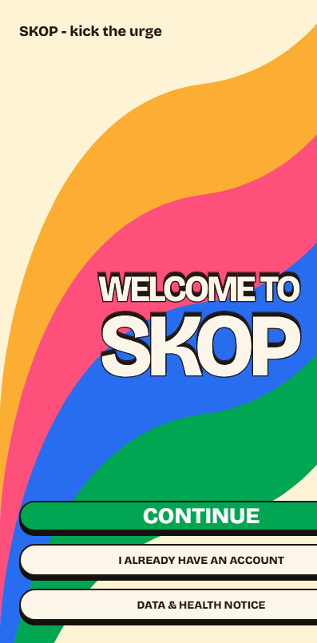
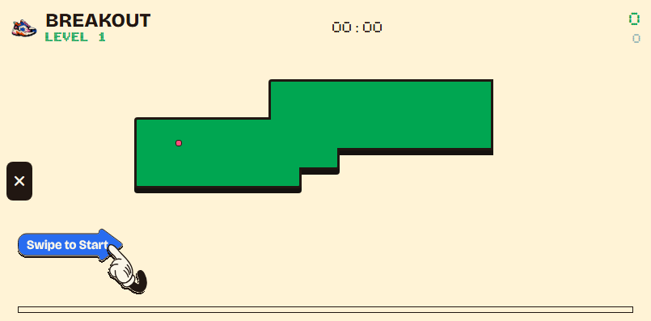

# SKOP: Kick the Urge

SKOP is a cross-platform mobile app that supports people who want to stop smoking cigarettes, stop vaping, or reduce their nicotine use before a target quit date. It combines progress tracking, spending check-ins, support guidance, and a swipe-controlled distraction game called Breakout.

The name **SKOP** comes from the Afrikaans word for "kick". The project uses a neobrutalist visual system and was designed for phone and tablet layouts in portrait and landscape.

## Inspiration cards

This project started from three inspiration cards:

- **Habit Builder:** reinterpreted as helping a person break a nicotine habit and build a quit plan.
- **Timer/Clock:** used for streaks, target-date countdowns, game time, and session records.
- **Landscape Support:** used across the app and made part of Breakout, which is played in landscape.

## Problem statement

Nicotine urges do not last the same amount of time for every person. Many quit apps focus on a cold-turkey streak and provide little support for people who want to reduce first. SKOP supports three paths: already quit, ready to quit, and cut down first. The game remains available during each path as a distraction when the user needs it.

## Core features

- Email and password accounts with Firebase Authentication and email verification
- Age-aware account flow with youth support and guardian consent for users aged 13 to 17
- Cigarette, vaping, or combined nicotine plans
- Already quit, ready to quit, and cut-down journeys
- Quit streaks and target-date countdowns
- Estimated money saved after a confirmed quit
- Daily, weekly, or monthly spending check-ins
- Local check-in caching and Firestore sync
- Optional local check-in reminders
- Breakout game with swipe controls, generated routes, scoring, levels, and session recording
- Session insights, recent sessions, time totals, and urge guidance
- Responsive phone and tablet layouts in portrait and landscape

## Screenshots

| Welcome | Breakout |
| --- | --- |
|  |  |

## Tech stack

| Area | Technology |
| --- | --- |
| App | React Native 0.81 and React 19 |
| Tooling | Expo SDK 54 |
| Navigation | Expo Router 6 |
| Authentication | Firebase Authentication |
| Database | Cloud Firestore |
| Local cache | AsyncStorage |
| Notifications | Expo Notifications |
| Testing | Jest and Jest Expo |
| Language | TypeScript |

## Run the project

### Requirements

- Node.js 20 or later
- npm
- Expo Go with SDK 54 support for device testing
- An Android or iOS device on the same network as the development computer

### Install

```bash
git clone https://github.com/241322/SKOP-mobile-app.git
cd SKOP-mobile-app
npm install
```

The Firebase client configuration required by the app is included in the repository. No `.env` file or Firebase service account is needed to assess the app. Firebase client keys identify the Firebase project, while Firebase Authentication and Firestore rules control access to user data.

### Expo Go

```bash
npm run expo
```

Scan the QR code with Expo Go. If Metro has stale cached files, run:

```bash
npm run expo:clear
```

### Web

```bash
npm run web
```

Expo opens the web app at `http://localhost:8081`.

## Firebase behaviour

- Accounts use email and password authentication.
- New accounts must verify their email before profile data can be stored or read.
- User profiles, SKOP sessions, and spending check-ins are stored in Firestore.
- AsyncStorage keeps local session and check-in data available while the device is offline.
- Cached data syncs after authentication and network access return.
- Firestore rules restrict each signed-in user to their own profile, sessions, and check-ins.
- Firebase Admin credentials and private signing keys are not stored in this repository.

## Tests and checks

```bash
npm test
npm run lint
npx tsc --noEmit
```

The Jest suite covers journey date rules, age groups, spending calculations, completed check-in periods, and streak calculations.

## Platform notes

- **Android:** tested through Expo Go on a Samsung S23 FE, including portrait and landscape layouts.
- **Web:** supported through React Native Web and Expo Router static web output.
- **iOS:** configured through Expo and React Native with tablet support. Runtime testing has not been completed because an Apple test device and macOS build machine were not available.
- **Tablets:** responsive layouts are provided for portrait and landscape widths.
- **Breakout:** the game asks the device to use landscape while a session is active.

## Known limitations

- Android remote push notifications are not available in Expo Go from SDK 53 onward. SKOP only schedules local reminders, but notification testing may require a development build when Expo Go reports its remote-notification warning.
- iOS runtime behaviour still needs testing on Apple hardware.
- Guardian consent is a guardian self-attestation flow. It does not verify government identity or replace legal review.
- Guidance in SKOP is educational and does not replace support from a doctor or pharmacist.

## Demonstration video

**Google Drive link:** To be added before submission.

The final link must be shared as **Anyone with the link can view**.

## Project structure

```text
app/                 Expo Router screens and layouts
components/skop/     Shared SKOP components
constants/           Theme values and app constants
context/             Authentication and session state
lib/                 Firebase data, domain logic, sync, and reminders
assets/              Icons, images, fonts, and game assets
__tests__/           Jest domain tests
firestore.rules      Firestore access and validation rules
```

## Assessment details

- **Student:** Xander Poalses
- **Student number:** 241322
- **Course:** DV300
- **Assessment:** Theme 3 Summative Assessment, Final Mobile Application
- **Institution:** Open Window
- **Submission:** 19 August 2026

## Repository

[github.com/241322/SKOP-mobile-app](https://github.com/241322/SKOP-mobile-app)
